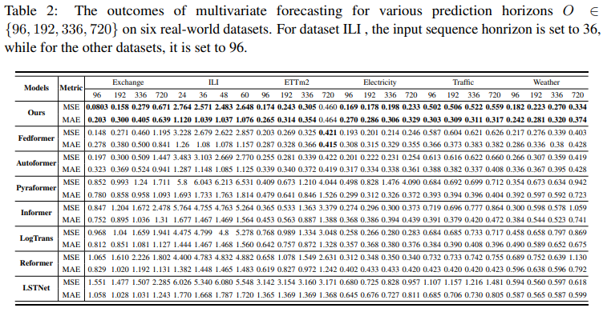
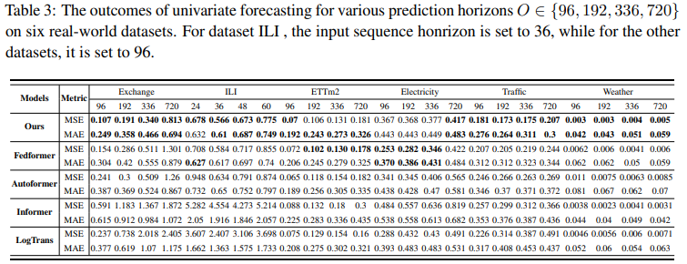
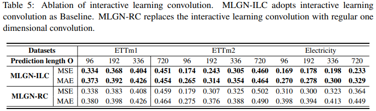
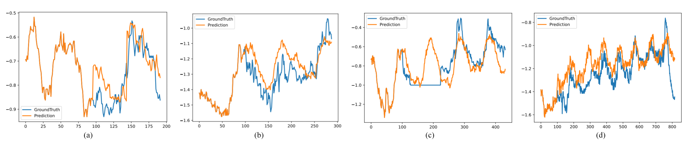

# MLGN (Please stay tuned for further updates on our progress. Thank you for your interest in our work.)
Code release of paper ["Multi-Scale Local-Global Feature Learning Network for Long-term Series Forecasting"](https://openreview.net/) 
MLGN achieve SOTA on six benchmarks.


##  Overall Architecture
As shown in Figure 1, we decompose the time series into seasonal part and trend part by Multi-scale Sequence Decomposition. For seasonal part, we use Seasonal Component Prediction block to predict. For trend part, we use a simple full-connected layer to predict. 
<p align="center">

<br><br>
</p>


### Seasonal Prediction block
The seasonal part contains several different patterns after Multi-scale Sequence Decomposition. For each pattern, we use local-global module to discovery local temporal features and global relations. 
<p align="center">

<br><br>
</p>


#### Local-Global module
We use down-sampling interactive learning convolution to capture local features and causal frequency enhancement module to discover global correlations. 
<p align="center">

<br><br>
</p>

#### Interactive learning convolution
We use downsampling convolution to capture local features.
<p align="center">

<br><br>
</p>

#### Causal frequency enhancement module
We use causal frequency enhancement module to discover global correlations
<p align="center">

<br><br>
</p>

## Get Started

1. `pip install -r requirements.txt`

2. Data. All the six benchmark datasets can be obtained from [Google Drive](https://drive.google.com/file/d/1CC4ZrUD4EKncndzgy5PSTzOPSqcuyqqj/view?usp=sharing) or [Tsinghua Cloud](https://cloud.tsinghua.edu.cn/f/b8f4a78a39874ac9893e/?dl=1).

3. Reproducibility. We provide the experiment scripts of all benchmarks under the folder `./scripts`. You can reproduce the experiments results by:

```
bash ./scipts/ETTm.sh
bash ./scipts/ETTh.sh
bash ./scipts/ECL.sh
bash ./scipts/Exchange.sh
bash ./scipts/Traffic.sh
bash ./scipts/WTH.sh
bash ./scipts/ILI.sh
```

## Experiments
### Main Results
#### Multivariate results


#### Univariate results


### Model Analysis
#### ILC vs. RC


#### CFE vs. Masked self-attention, Isometric convolution


### Visualization
Visualization of forecasting results: The forecasting results from the test set of univariate
datasets, Electricity and Traffic, are visualized in Figure.9 and Figure.10.
The forecasting results from the test set of multivariate datasets, ETTm1 and ETTm2,
are visualized in Figure.11 and Figure.12.


Figure 9: Univariate forecasting cases using the Electricity dataset with model MLGN. Input-length =
96, Prediction-length = (96, 192, 336, 720).

Figure 10: Univariate forecasting cases using the Traffic dataset with model MLGN. Input-length = 96,
Prediction-length = (96, 192, 336, 720).

Figure 11: Multivariate forecasting cases using the ETTm1 dataset with model MLGN. Input-length =
96, Prediction-length = (96, 192, 336, 720).

Figure 12: Multivariate forecasting cases using the ETTm2 dataset with model MLGN. Input-length =
96, Prediction-length = (96, 192, 336, 720).
## Contact
If you have any questions, please contact jiangmaowei@sia.cn. Welcome to discuss together.

## Citation
If you find this repo useful, please cite our paper
```
@article{mlgn,
  title={MLGN: Multi-Scale Local-Global Feature Learning Network for Long-term Series Forecasting},
  year={2023}
}
```


## Acknowledgement

We appreciate the following github repos a lot for their valuable code base or datasets:

https://github.com/thuml/Autoformer

https://github.com/zhouhaoyi/Informer2020

https://github.com/zhouhaoyi/ETDataset

https://github.com/laiguokun/multivariate-time-series-data
